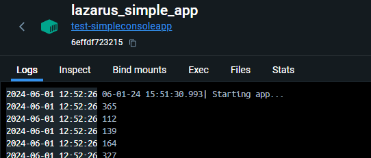

## ⚙ Docker Boilerplate for Lazarus Console App   
I use this boilerplate whenever I want to speedily start up a new Lazarus project that will be deployed with Docker on Linux

1. Compile project in Lazarus with Linux target. 
2. Copy binaries from <q>bin</q> folder into <q>test</q> folder.
3. Execute:

       cd test
       docker-compose build && docker-compose up -d

4. After building and deploying image on Docker, should be able to see logs from it:

5. Rebuild your image whenever you need make project changes.
